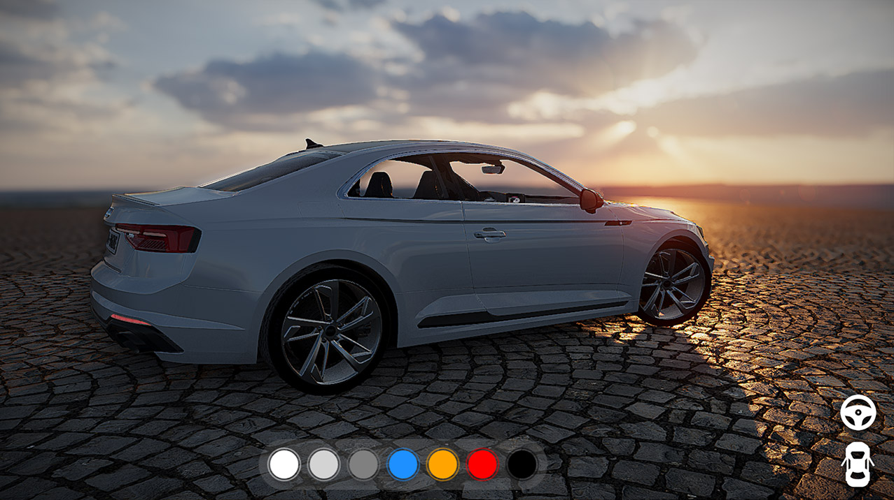
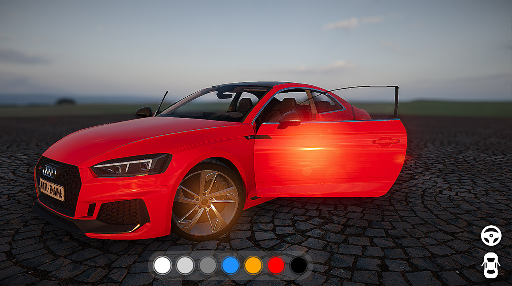
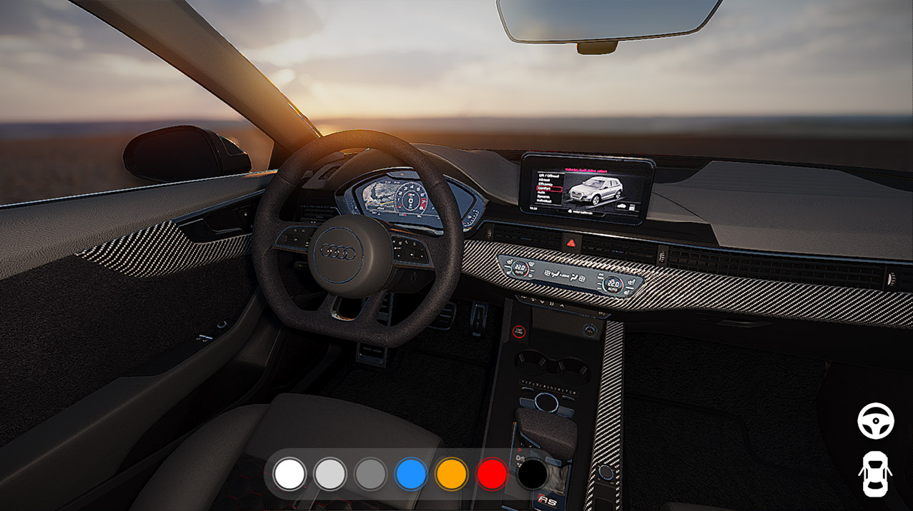

# Automotive Demo

This demo shows how you can use Evergine in an automotive environment application. It uses a simple WPF user interface to control different parts of the car.

Model created by **[Indians](https://sketchfab.com/Indians)** available in **[Sketchfab](https://sketchfab.com/3d-models/audi-rs5-2019-fae1a4186d464a6aae351ce9e9ff2401)** and adapted for this application.

## Build and Run
- Required Visual Studio 2022 with .NET6 support

### How to use
 * **Left Click + Mouse**: Interact with the UI to change the car color, open the doors or view the car interior.
 * **Right Click + Mouse**: Camera look.
 * **Mouse Wheel**: Camera zoom.
----
Powered by **[Evergine](https://evergine.com)**

LET'S CONNECT!

- [Youtube](https://www.youtube.com/subscription_center?add_user=WaveEngineChannel)
- [Twitter](https://twitter.com/WaveEngineTeam)
- [Blog](http://geeks.ms/waveengineteam/)
